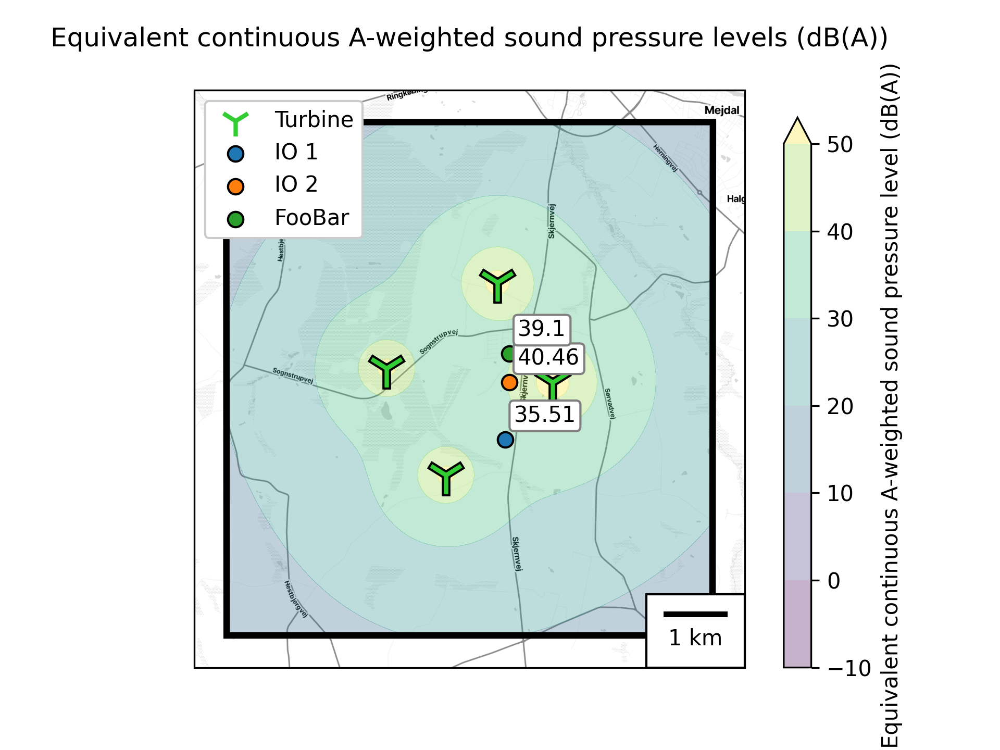

# windsim

Scalable Python framework for wind turbine noise prediction and mapping.

<div align="left"></div>

Windsim predicts noise at individual receiver locations and across spatial grids
using ISO 9613-2 based sound propagation calculations. It combines turbine sound
power spectra, elevation data, and parallel numerical computation to produce
noise maps and numerical results for analysis and custom Python workflows.
Shadow simulation is experimental and is not available through the CLI yet.



*Illustrative output from the bundled scenario: colored areas show predicted
A-weighted sound pressure levels in dB(A); labeled points show specific receiver
values. The turbine specifications in the example are illustrative.*

## Highlights

- **Point and grid predictions:** calculate sound pressure levels at specific
  receivers or on a grid with configurable extent, spacing, and height.
- **Frequency-dependent noise modeling:** supply octave-band turbine sound power
  spectra, with an option for the German *Interimsverfahren*.
- **Geospatial preparation:** transform coordinates and use FABDEM elevation
  data to position turbines and receivers; missing elevation tiles are downloaded
  and stored for reuse.
- **Maps and numerical data:** generate PNG maps, export NetCDF datasets, and
  access labeled Xarray results from Python.
- **Parallel computation:** configure Dask workers, threads, memory limits, and
  chunk sizes for larger receiver grids.

See [model assumptions and limitations](docs/noise-model.md) for the scope of the
calculations and the status of experimental features.

## Quick start

Requires Python 3.12 or newer. Install
[uv](https://docs.astral.sh/uv/getting-started/installation/), then download and
extract the [source archive](https://github.com/pschlo/windsim/archive/refs/heads/main.zip).
Open a terminal in the extracted directory.

The bundled example contains four illustrative turbines, three specific
receivers, and a receiver grid. To run it without a map-provider account, edit
`example_repository/shared/config.toml` and change the existing `[output]`
section's `assets` value to:

```toml
assets = ['file']
```

Then run:

```console
uv run windsim noise
```

The example's file settings write timestamped `specific-receivers_export_*.nc`
and `grid-receivers_export_*.nc` files to `output/` in the current working
directory. To generate a map instead, use `assets = ['map']` and replace the
placeholder in `[output.map.tiles]` with your own Stadia Maps API key. The map
is saved to `example_repository/projects/default/noise_output/output.png`.
Use `assets = ['map', 'file']` for both outputs.

The example includes an elevation tile. Other areas may require an initial
download of additional FABDEM tile collections; map output also needs network
access to its tile provider. See [the input guide](docs/input-repository.md) for
settings, units, output paths, and inspecting the exported data.

To use an existing data repository without downloading the source archive:

```console
uvx https://github.com/pschlo/windsim/archive/refs/heads/main.zip noise --root path/to/data-repository --project my-project
```

Append `--help` to see command options. The archive commands follow the rolling
`main` branch. For reproducible work, retain the source version, lockfile, input
files, and settings used for a run; use an immutable source version for repeat
installations.

## Input repository

Simulation data is organized separately from the source code:

```text
data-repository/
├── shared/
│   ├── config.toml          # simulation, computation, and output settings
│   └── fabdem/              # elevation tiles, downloaded when missing
└── projects/
    └── my-project/
        ├── setup.toml       # turbine models, turbines, and specific receivers
        └── noise_output/    # generated map output
```

`--root` selects the data repository; `--project` selects a project inside it.
The defaults are `./example_repository` and `default`. The CLI reads a shared
configuration and a separate setup file for each project. NetCDF exports use
the configured file-output folder rather than `noise_output/`.

Start with the [example setup](example_repository/projects/default/setup.toml)
and [configuration](example_repository/shared/config.toml). The
[input guide](docs/input-repository.md) explains the supported fields,
longitude/latitude order, heights, elevations, and sound power spectra.

## Architecture and customization

Windsim uses [Planner](https://github.com/pschlo/planner), also developed by Peter
Schlosshan, to assemble workflows from assets and recipes. Input preparation,
terrain loading, simulation, and output generation are separate processing
stages. Custom Python workflows can supply existing assets or substitute
providers while preserving the expected data structures.

| Library | Role |
| --- | --- |
| Planner | Resolve stage dependencies, assemble execution plans, and manage resources and storage |
| Xarray | Represent labeled multidimensional inputs and results |
| Dask | Execute lazy numerical calculations in parallel |

Possible extensions include custom input adapters, terrain providers, and
exports. These require Python code and explicit provider selection. The
[customization guide](docs/extending.md) includes a minimal executable example
and explains the constraints on replacing recipes.

## Research background

The original noise implementation, model assumptions, software design, and
performance evaluation are documented in Peter Schlosshan's bachelor's thesis
at RWTH Aachen University (November 2024):

[**Efficient and Scalable Sound Propagation Modeling for Predicting Wind Turbine Noise Immission**](https://ths.rwth-aachen.de/wp-content/uploads/sites/4/thesis_Schlosshan.pdf).

The thesis compares the original implementation with WindPRO. Its tested noise
scenario ran 22–108 times faster, with barrier attenuation disabled; a separate
multicore evaluation showed approximately sixfold speedup. These are historical
results for the configurations in Sections 6.1–6.2, not benchmarks of the current
version. Agreement with another implementation is not validation against field
measurements. Use the thesis when citing the methods and original evaluation,
and identify the software version and inputs when reporting new results.

## Current scope

Noise prediction is the primary CLI workflow. Shadow and Harmonoise code are
experimental; barrier inputs are not fully integrated. The default preparation
uses fixed atmospheric and operating assumptions, and the TA Lärm aggregation
does not implement the full assessment procedure described in the thesis.
Output generation computes the selected arrays in memory, so workload size
still matters when using chunked computation.

See [model assumptions and limitations](docs/noise-model.md) before changing
acoustic options or interpreting results.

## Development

```console
uv sync --locked
uv run python -m pytest
uv build
```

Planner is installed from its rolling `main` archive, with an artifact hash in
the lockfile. Run `uv lock --refresh-package planner` to deliberately refresh
that dependency. See [customization](docs/extending.md) before changing the
default recipe bundle.
